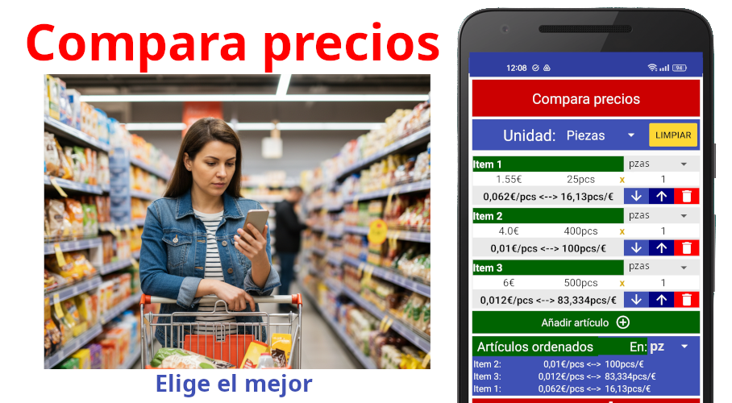
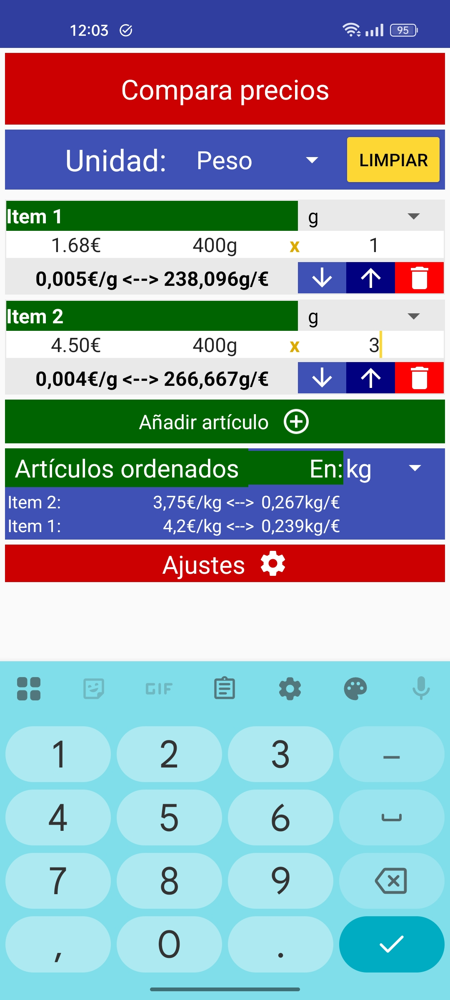
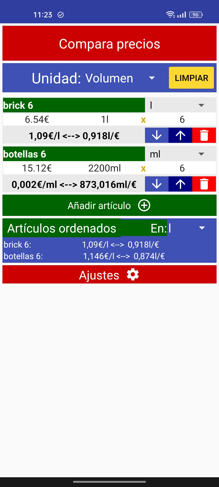
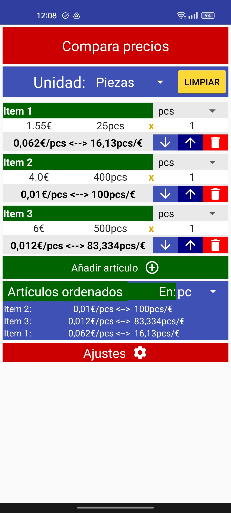
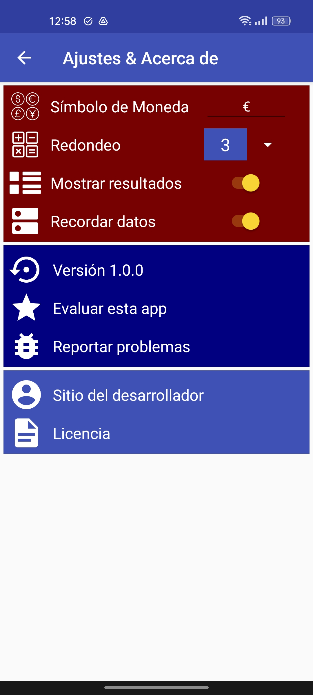

<h1>Compara precios</h1>

Una APP sencilla que te permite compara precios de productos cuando tienen diferentes cantidades

    

    

## Introducción
El origen de esta APP es un trabajo realizado por: [Brent Vollebregt](https://nitratine.net/). Si quieres acceder a su código: https://github.com/brentvollebregt/price-per-unit
Aprovecho para dar gracias a Brent Vollebregt por su trabajo e invito a todos a ver su página web donde tiene cosas muy interesantes. Gracias.

Mi intención era adaptar la APP "price-per-unit" a mi gusto y necesidades.
El resultado es lo que ves, la APP "Compara precios".
El cambio verdaderamente importante es que ahora se muestra el precio por unidad de medida, por ejemplo 12€/kg.
El resto son pequeñas modificaciones

## Capturas de pantalla

|  |  |  |  |
|---------------------------------------------------------------------------------------------------------------------------|---------------------------------------------------------------------------------------------------------------------------|---------------------------------------------------------------------------------------------------------------------------|---------------------------------------------------------------------------------------------------------------------------|

## Características
Compare un número ilimitado de productos para encontrar el mejor precio. Ahorre dinero de forma inteligente.

Muchas veces nos encontramos con productos que se venden a distintos precios según la cantidad y se hace difícil saber que producto es más barato.

Con la APP "Compara precios", puede dar un nombre (opcional) a cada producto, introducir el precio, la cantidad y cuantas unidades de cada artículo. La APP calculará automáticamente el precio por la cantidad total de producto y la cantidad obtenida por moneda elegida. A continuación, se clasifican los artículos en función del mejor valor para que pueda encontrar fácilmente el mejor precio.

Las características incluyen:
* 4 tipos de unidades (Peso, Volumen, Longitud y Piezas).
* Cambio fácil del símbolo de la moneda.
* Resumen del precio de cada producto (precio/unidad de medida y cantidad/precio).
* Puede ver todos los artículos al mejor precio ordenados a una sola unidad de medida.
* Cambiar el número de decimales para el redondeo.
* Recuerde los datos después de cerrar la aplicación.
* La APP no necesita permisos. ¡Sin permisos!
* La APP no muestra publicidad. ¡Sin anuncios!
* La APP no recoge datos personales. ¡No espía!

Esta aplicación es ideal para encontrar el mejor precio en los supermercados, tiendas online, o en cualquier sitio.
Esta aplicación no tiene anuncios, no requiere permisos, y no recoge datos.

## Desarrollo

Android Studio